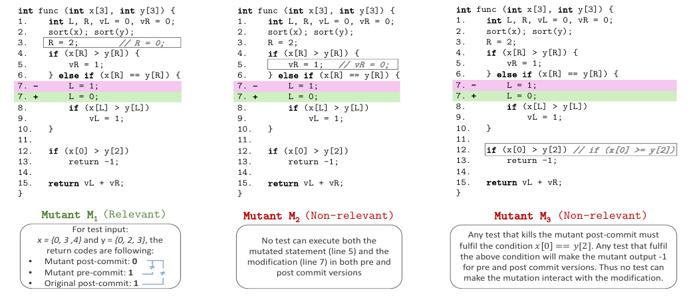
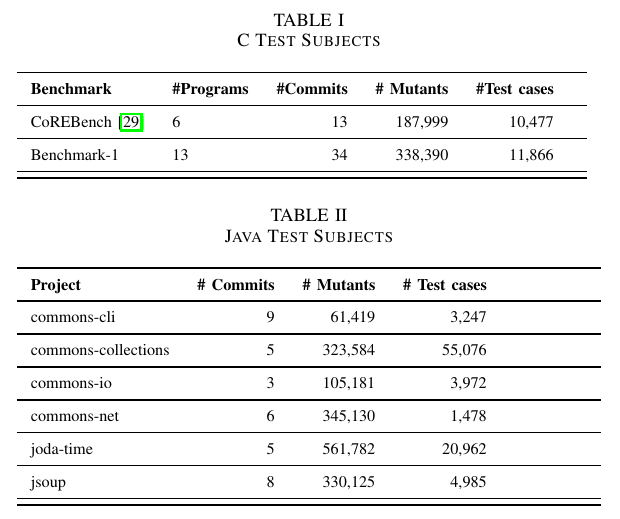

## Notification
Our work [Commit-Aware Mutation Testing](https://orbilu.uni.lu/bitstream/10993/44125/1/ICSME20.pdf) is accepted by ICSME2020. If you want to use our dataset,
please contact me, wei.ma@uni.lu or milos.ojdanic@uni.lu.
## What is Mutation Testing ?
[Mutation Testing](https://en.wikipedia.org/wiki/Mutation_testing) is proved to be a strong test criteria in Software Testing, which can improve the test quality to
make the software robust, reliable and stable. The developers use some automatic tools to mutate(change) the code of under test to 
create many mutants, e.g., [PIT](https://pitest.org/), [Mart](https://github.com/thierry-tct/mart) and [Mull](https://github.com/mull-project/mull). The test suite is run against the mutants to see if these mtuants can be killed or not. The developer will
make the tests to try kill more mutants. Once, the developers arrive at the test requirements, and then stop mutation testing with some new
good test cases. 
#### Related Articles 
1. [Mutation Testing in Software Testing: Mutant Score & Analysis Example ](https://www.guru99.com/mutation-testing.html)
2. [Mutation Testing Advances: An Analysis and Survey](https://www.sciencedirect.com/science/article/pii/S0065245818300305)
3. [An Analysis and Survey of the Development of Mutation Testing](https://ieeexplore.ieee.org/abstract/document/5487526)

## What is Regression Testing?
Regresstion Testing is an important test activity during the continuous integration to guarantee the software after change have the same correct behavior and functions with the previous version.
#### Related Articles
1. [Regression Testing](https://en.wikipedia.org/wiki/Regression_testing)
2. [What is Regression Testing? Definition, Tools, Method, and Example](https://www.softwaretestinghelp.com/regression-testing-tools-and-methods/)

## What is Commit-Aware Mutation Testing?
Mutation Testing is expensive and the code change is often frequent in Continuous Integration. It is very expensive to apply
Mutation Testing in Regression Testing. Usually, the code has small change in one commit. And intuitively, not all of mutants are
useful to test the test of the code change. Insted of the entire mutant set to test the whole program,  we define commit-relevant mutants; a set of mutants that affect the changed program behaviours and represent the commit-relevant test requirements. 

#### Definition and Example of Commit-Aware Mutant
- Definition
 The regression changes interact with a mutant when the program version that include both the regression changes and the mutant behaves differently from:
    1.  the version that inlcudes only the mutant(mutant in the pre-commit version).
    2. the version that includes only the regression changes(post-commit version).
- Example
  We can see that mutant 1 is relevant to the commit change but mutant 2 and 3 are non-relevant.
   

## Datasets
We study tow languages projects, C and Java, which are widely used in the world. For C, we study the commits from [Coreutils](https://www.gnu.org/software/coreutils/) and [CoREBench](https://www.comp.nus.edu.sg/~release/corebench/),
 and use Symolic Execution to augment the test suite. For Java, we use the projects from Apache. The below tables summarize our research dataset.
 

### Result
We mainly study the relationship between relevant mutation score and the tradition mutation score. In the end,
we find that the classical mutation score cannot be an indicator of the relevant mutation score. The more details 
can be found in our paper, [Commit-Aware Mutation Testing](). Here, we shows the complement results of Kendall and Pearson correlation for our paper.

---
Symbols 
- MS: Mutation Score
- Delta MS: The difference of Mutation Score between the pre and post version
- RMS: Relevant Mutation Socre
- TS: Falut Relevant Score
- Subsuming： Only count the subsumed mutants.

---
Conclusion
- It is necessary to use Relevant Mutants in Regression Testing. The traditional Mutatsion Score cannot indicate how
RMS is. 
---

### Correlations

- MS of Modification and Delta MS 
  
  
- RMS and Delta MS
  
  
- RMS and MS
  
  
- RMS and MS of Modification
  
  
- Subsuming RMS and Delta Subsuming MS
  
  
- Subsuming RMS and Subsuming MS
  
  
- TS and MS
  
  
- TS and MS of Modification
  
  
- TS and Subsuming MS
  
  
- TS and Subsuming RMS
  
  
